# H&M Fashion Store

## Overview

The H&M Fashion Store is a full-stack e-commerce application deployed on AWS EKS (Elastic Kubernetes Service) using a two-phase approach:

**1. Local Development** - Application tested and validated on local machine

**2. Production Deployment** - Deployed to AWS EKS via Bitbucket Pipelines using Self-Hosted Runners

**It features**:

- React frontend with responsive design

- Node.js backend API with JWT authentication

- PostgreSQL database with persistent storage

- AWS ALB Ingress Controller for traffic routing

- SSL/TLS encryption for secure communication

- User registration and authentication

- Product browsing with categories

- Shopping cart functionality

- Order placement

- Product filtering by category, size, and price

- JWT-based session management

---

## Architecture diagram

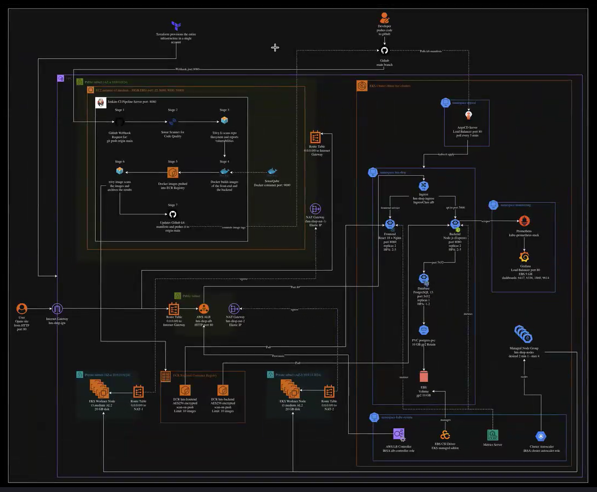

**Architecture Traffic Flow**


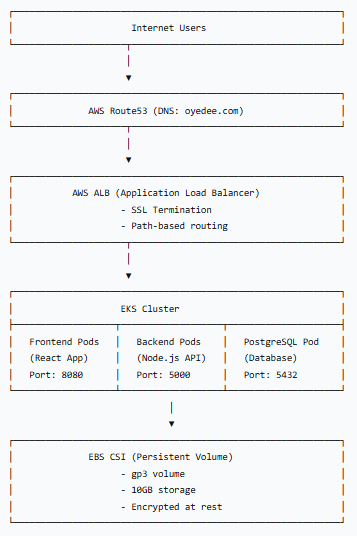

---

## AWS Resources Required

- EKS Cluster (v1.28+)

- ECR Repositories (backend & frontend)

- ACM Certificate for domain

- Route53 Hosted Zone

- IAM Roles for EBS CSI and ALB Controller

---

## Setup

**Step 1: Install Dependencies on Runner and Provision**

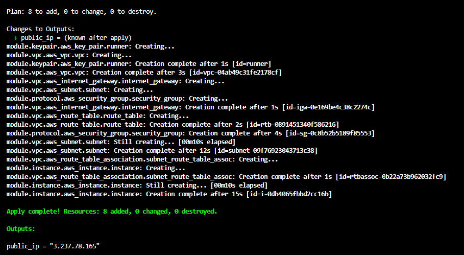

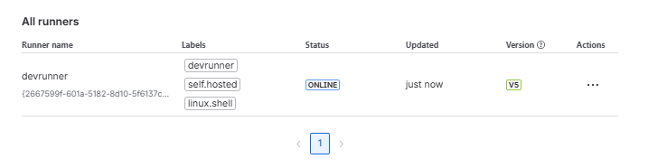

**Step 2: Deployed Infrastructure Code**

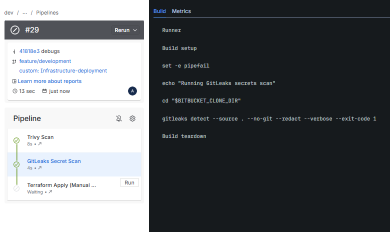

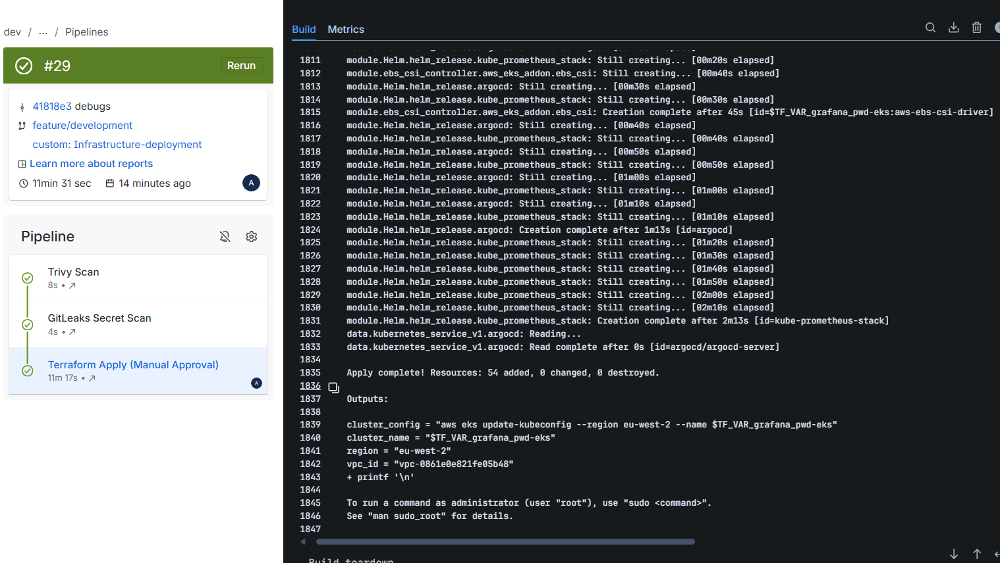

**Ensure all pods are up and running**:

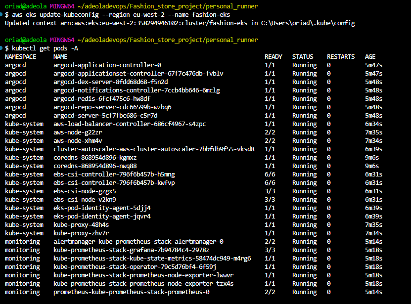

**Step 3: Login To SonarQube and Generate Token**

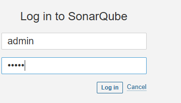

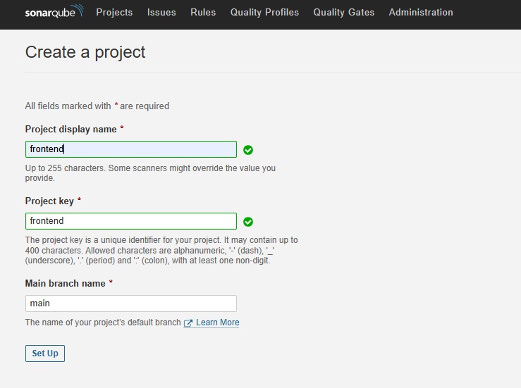

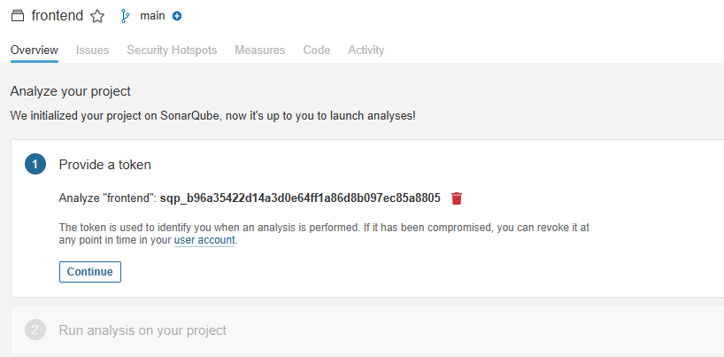

**Step 4: Update Application Repository Variable**

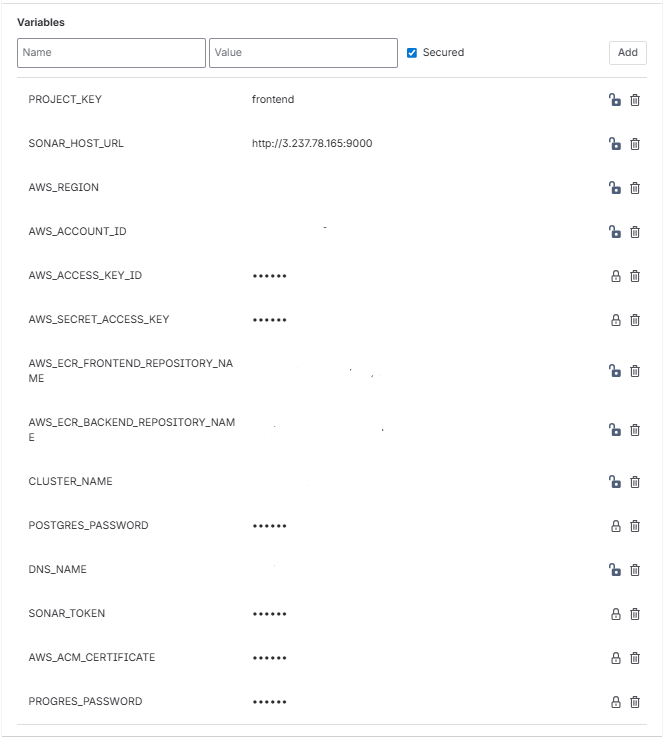

**Step 5: Application deploy**

Once commit is tag, pipeline will trigger automatically**

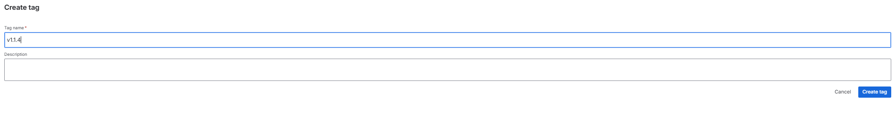

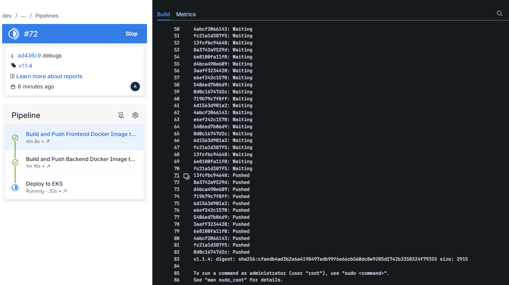

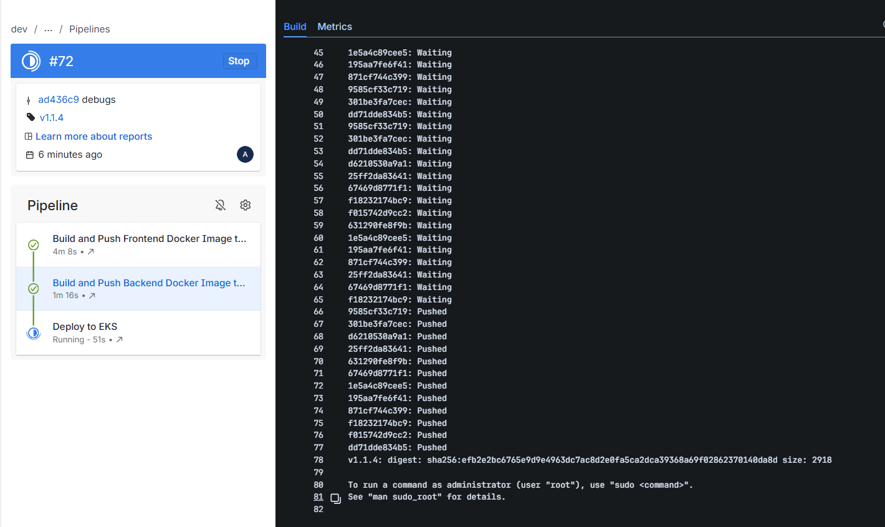

**Wait till application is successfully deploy**

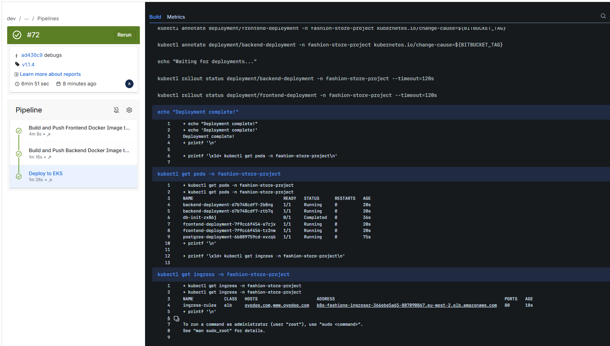

---

## Pipeline Workflow

The pipeline is written in such a way that once a commit is tagged, it will trigger the pipeline to run the following steps:

**1. Frontend Image Build and Push**

- SonarQube scans code for bugs, vulnerabilities, security hotspots, and code smells

- Gitleaks detects secrets and passwords before image build

- Trivy scans the built image for secrets and vulnerabilities before pushing to AWS ECR

- AWS ECR also scans the image on push (image_scanning_configuration {scan_on_push = true})

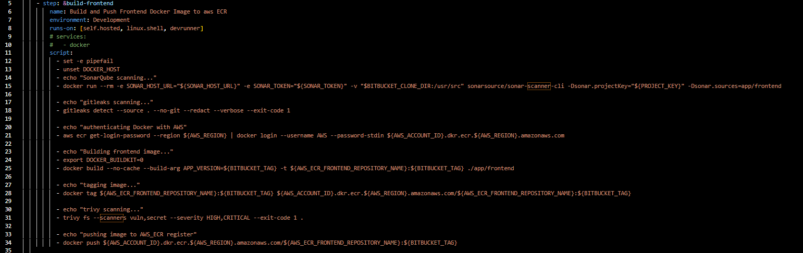

**2. Backend Image Build and Push**

- Same security scanning process as frontend

- SonarQube analyzes backend Node.js code

- Multiple security layers ensure no vulnerabilities reach production

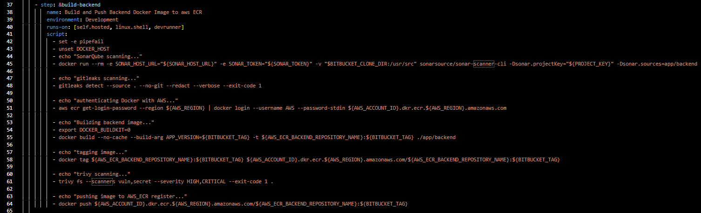

**3. Application Deployment**

The progress.yaml is deployed first, which creates:

- Namespace

- StorageClass

- Secret

- PVC

- Postgres-service

- Postgres-deployment

The pipeline then:

    1. Waits 120 seconds for PostgreSQL to be ready

    2. Initializes the database (waits 120 seconds for job completion)

    3. Deploys backend and frontend deployments

    4. Deploys Ingress

    5. Updates containers with the Bitbucket tag

    6. Annotates deployments with change cause

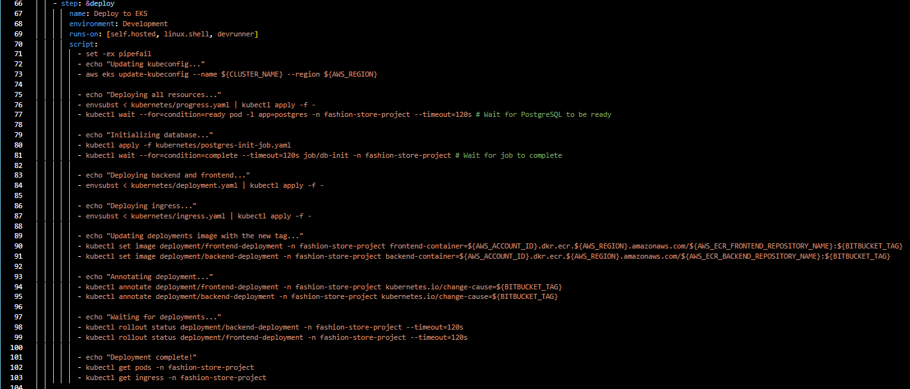

---

## Testing

###  Local Testing Results

**EKS Deployment Verification**

**Pod Status**
```
kubectl get pods -n fashion-store-project
```
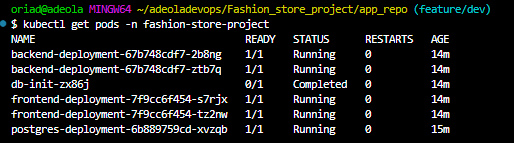

**ingress with ALB address**
```
kubectl get ingress -n fashion-store-project
```
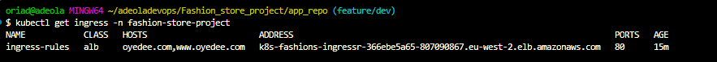

### Production Application Testing

Test 2: Backend Health Endpoint Test
```
ALB_DNS=$(kubectl get ingress ingress-rules -n fashion-store-project -o jsonpath='{.status.loadBalancer.ingress[0].hostname}')
curl -k -H "Host: oyedee.com" "https://$ALB_DNS/api/health"
```
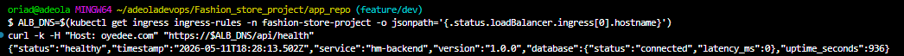

**health endpoint**
```
curl -k https://oyedee.com/api/health
```
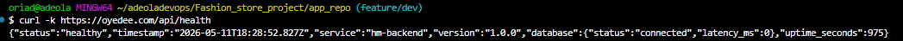

**Registration test**
```
curl -k -X POST https://oyedee.com/api/auth/register \
  -H "Content-Type: application/json" \
  -d '{"email":"test@example.com","password":"Test123!","name":"Test User"}'
```
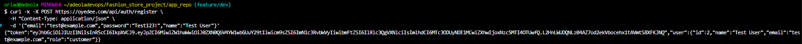

**products test**
```
curl -k https://oyedee.com/api/products
```
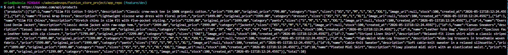

Test 3: Products API test
```
curl -k -H "Host: oyedee.com" "https://$ALB_DNS/api/products" | jq '.products | length'
```
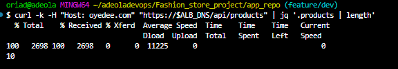

Test 4: User Registration
```
curl -k -H "Host: oyedee.com" -X POST "https://$ALB_DNS/api/auth/register" \
  -H "Content-Type: application/json" \
  -d '{"email":"test@example.com","password":"Test123!","name":"Test User"}'
```
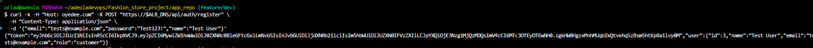

Test 5: User Login
```
curl -k -H "Host: oyedee.com" -X POST "https://$ALB_DNS/api/auth/login" \
  -H "Content-Type: application/json" \
  -d '{"email":"test@example.com","password":"Test123!"}'
```
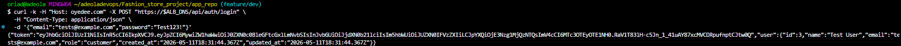

Test 6: Browser End-to-End Testing

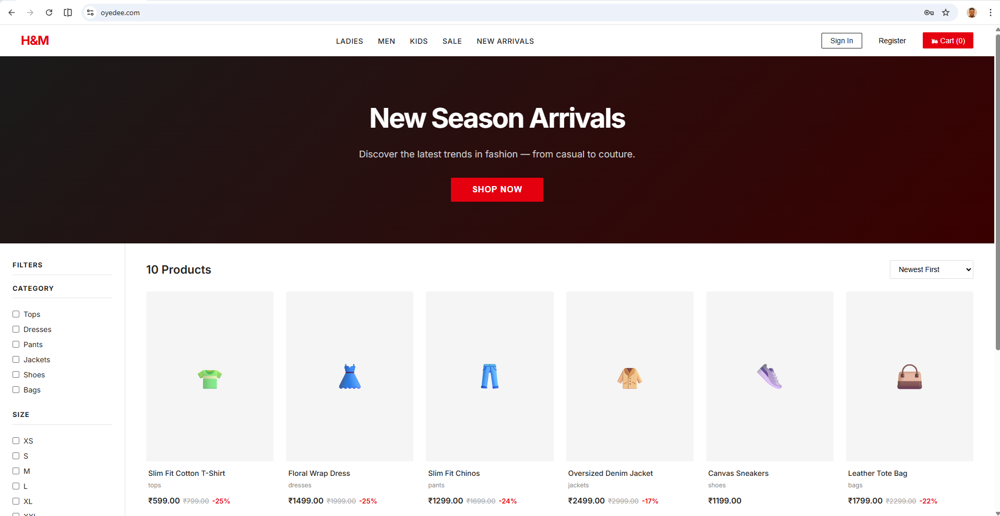

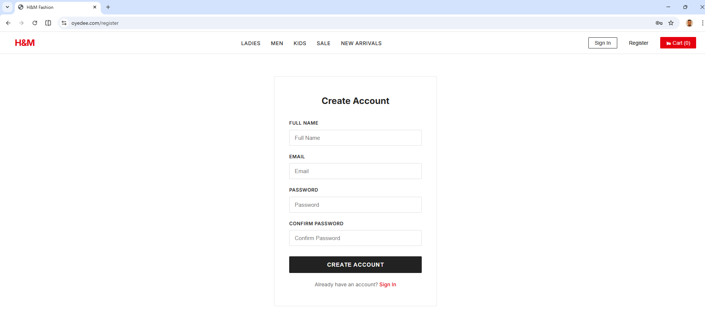

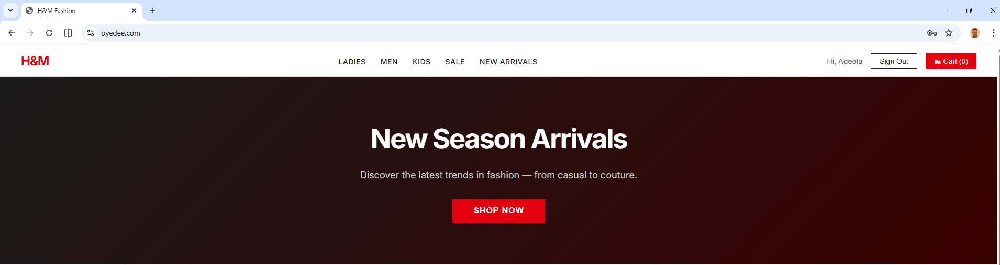

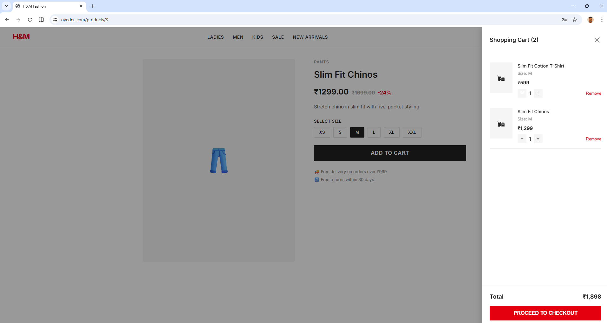

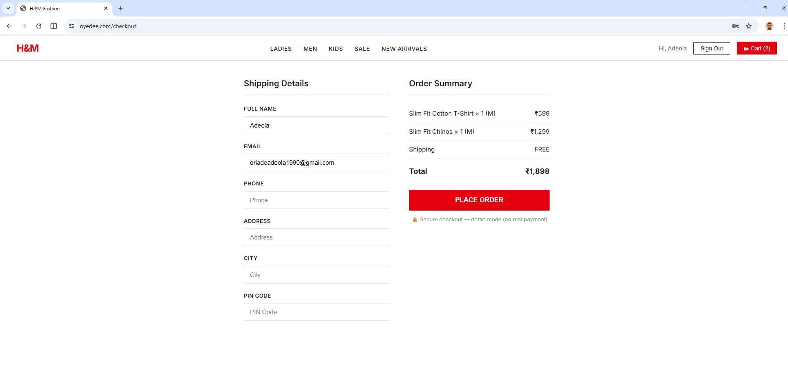

---

## Challenges & Solutions

**Challenge 1**: Local PostgreSQL Data Directory Error

**Problem**: PostgreSQL failed to start locally due to mounted volume containing lost+found directory

**Error Message**:
```
initdb: error: directory "/var/lib/postgresql/data" exists but is not empty
initdb: detail: It contains a lost+found directory, perhaps due to it being a mount point
```

**Solution**: Set PGDATA environment variable to use a subdirectory
```
env:
- name: PGDATA
  value: /var/lib/postgresql/data/pgdata
```
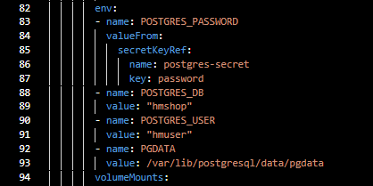

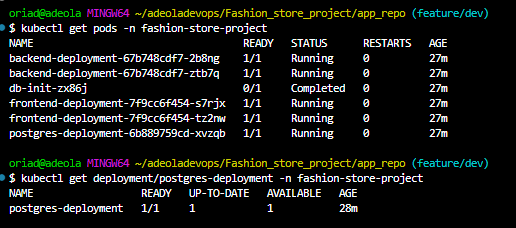

**Challenge 2**: Bitbucket Runner Not Connecting to EKS

**Problem**: Self-hosted runner couldn't access EKS cluster

**Error Message**:
```
Unable to connect to the server: dial tcp: lookup fashion-eks: no such host
```

**Solution**: Updated kubeconfig on runner
```
aws eks update-kubeconfig --region eu-west-2 --name fashion-eks --role-arn arn:aws:iam::xxx:role/eks-admin
```

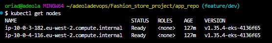

**Challenge 3**: Pipeline Timeout During Deployment

**Problem**: Self-hosted runner timing out during long deployments

**Error Message**:
```
The job has been terminated because it exceeded the maximum time limit of 60 minutes.
```
**Solution**:

- Increased pipeline timeout to 120 minutes

- Optimized deployment steps

- Added parallel build steps for frontend and backend

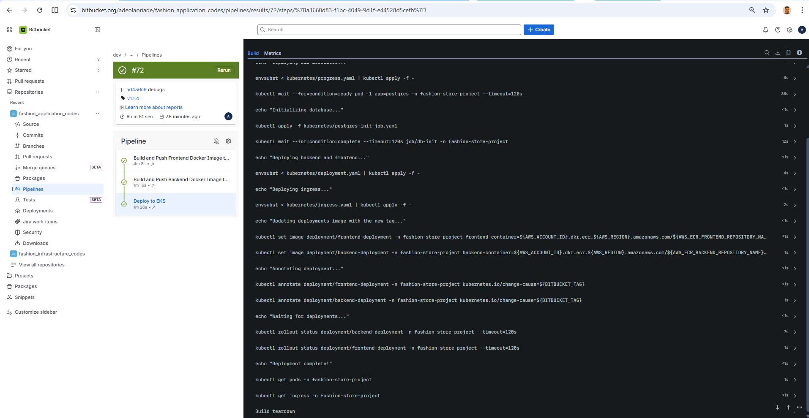

**Other checks snapshot**

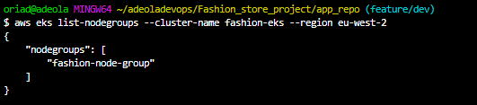

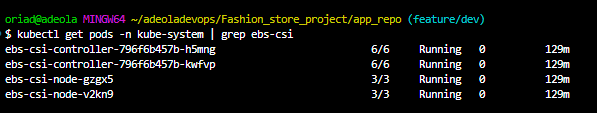

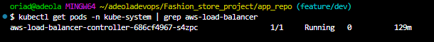

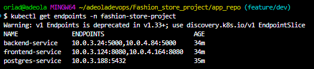

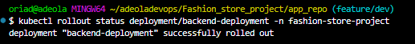

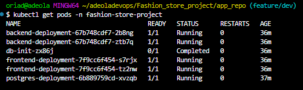

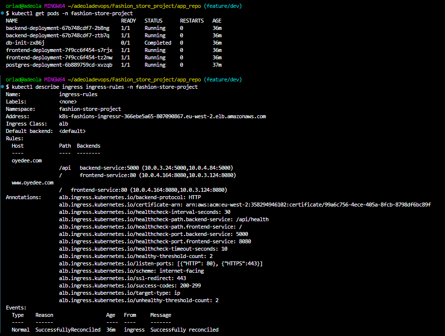

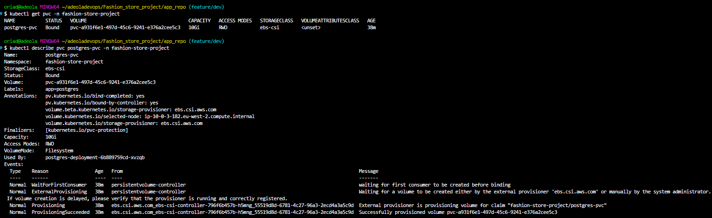

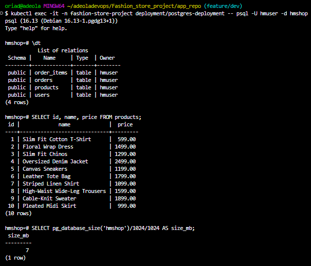

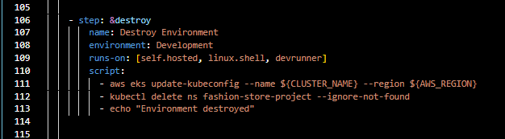

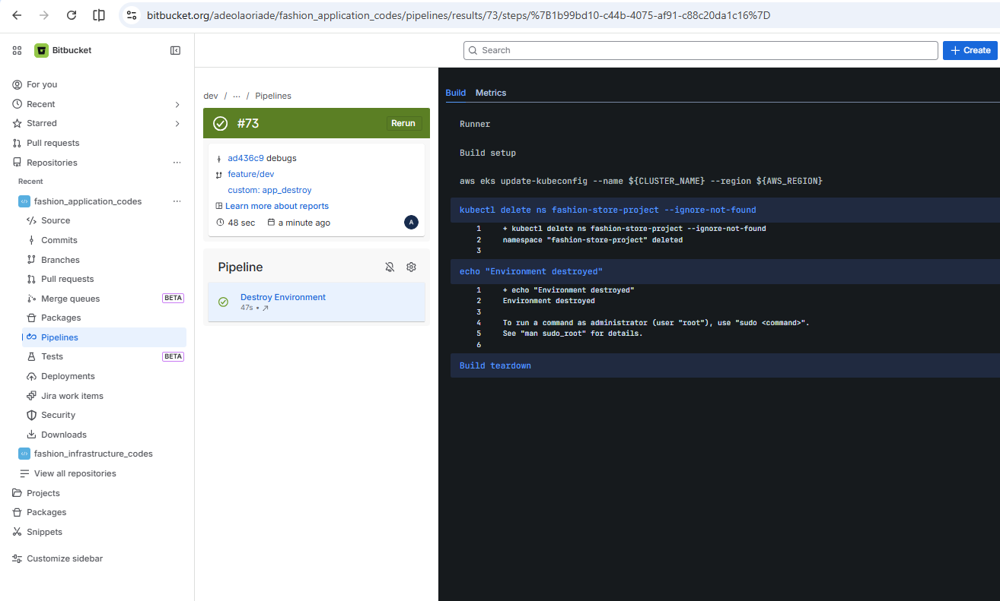

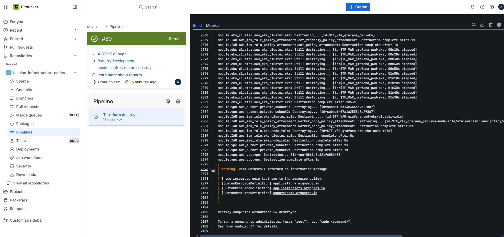

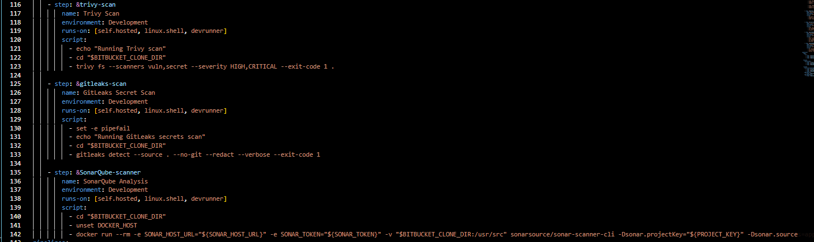

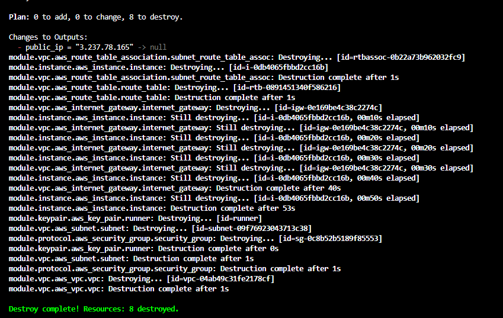

---

## Debugging Tools

**Local Debugging**
```
# Backend logs
tail -f backend/logs/error.log

# PostgreSQL logs
tail -f /var/log/postgresql/postgresql-16-main.log
```

**EKS Debugging**
```
# Cluster status check
aws eks describe-cluster --name fashion-eks --region eu-west-2

# Node groups check
aws eks list-nodegroups --cluster-name fashion-eks --region eu-west-2

# EBS CSI driver check
kubectl get pods -n kube-system | grep ebs-csi

# ALB controller check
kubectl get pods -n kube-system | grep aws-load-balancer
```

**Network Debugging**
```
# connectivity between pods
kubectl exec -n fashion-store-project deployment/backend-deployment -- curl -s http://postgres-service:5432

# Connectivity from frontend to backend test
kubectl exec -n fashion-store-project deployment/frontend-deployment -- curl -s http://backend-service:5000/api/health

# DNS resolution inside cluster test
kubectl exec -n fashion-store-project deployment/backend-deployment -- nslookup postgres-service

# Service endpoints check
kubectl get endpoints -n fashion-store-project
```

**Browser Debugging**

| Tool	| Shortcut	| Use |
|-----|-------|-----|
| Chrome DevTools	| F12 or Ctrl+Shift+I	| Debug JavaScript, inspect network |
| React DevTools	| Install extension	| Inspect React component tree |
| Redux DevTools	| Install extension	| Debug state management |

**Production Monitoring**
```
# Watch pods
kubectl get pods -n fashion-store-project -w

# View logs
kubectl logs -f -n fashion-store-project deployment/backend-deployment

# Rollback if needed
kubectl rollout undo deployment/backend-deployment -n fashion-store-project

# Rollout status check
kubectl rollout status deployment/backend-deployment -n fashion-store-project
```

**Kubernetes Commands**
```
# All pods in namespace check
kubectl get pods -n fashion-store-project

# Detailed pod information get
kubectl describe pod <pod-name> -n fashion-store-project

# Pod logs view
kubectl logs <pod-name> -n fashion-store-project
kubectl logs deployment/backend-deployment -n fashion-store-project --tail=100 -f

# Service endpoints check
kubectl get endpoints -n fashion-store-project

# Ingress check
kubectl describe ingress ingress-rules -n fashion-store-project

# PVC status check
kubectl get pvc -n fashion-store-project
kubectl describe pvc postgres-pvc -n fashion-store-project

# Port forwarding for local testing
kubectl port-forward -n fashion-store-project deployment/backend-deployment 5000:5000
kubectl port-forward -n fashion-store-project deployment/frontend-deployment 8080:8080
```

**Database Debugging**
```
# PostgreSQL connect
kubectl exec -it -n fashion-store-project deployment/postgres-deployment -- psql -U hmuser -d hmshop

# Tables check
\dt

# Users view
SELECT * FROM users;

# Products check
SELECT id, name, price FROM products;

# Database size check
SELECT pg_database_size('hmshop')/1024/1024 AS size_mb;
```

---

## Conclusion

This deployment covers the complete CI/CD pipeline setup for the H&M Fashion Store application using:

- Local Development - Testing and validation before production

- Self-Hosted Runner - EC2 instance running Bitbucket runner

- Multi-stage Security Scanning - SonarQube, Gitleaks, Trivy

- AWS ECR - Secure container registry with image scanning

- AWS EKS - Production Kubernetes cluster

- Bitbucket Pipelines - Automated CI/CD workflow

The pipeline ensures that every tagged commit goes through:

- Security scanning (code and image)

- Docker image build and push

- Kubernetes deployment with zero downtime

- Health checks and validation

---
# Author

Name Adeola Oriade

Email: adeoladevops@gmail.com

This repository is part of my ongoing effort to document my cloud journey and share what I learn publicly.